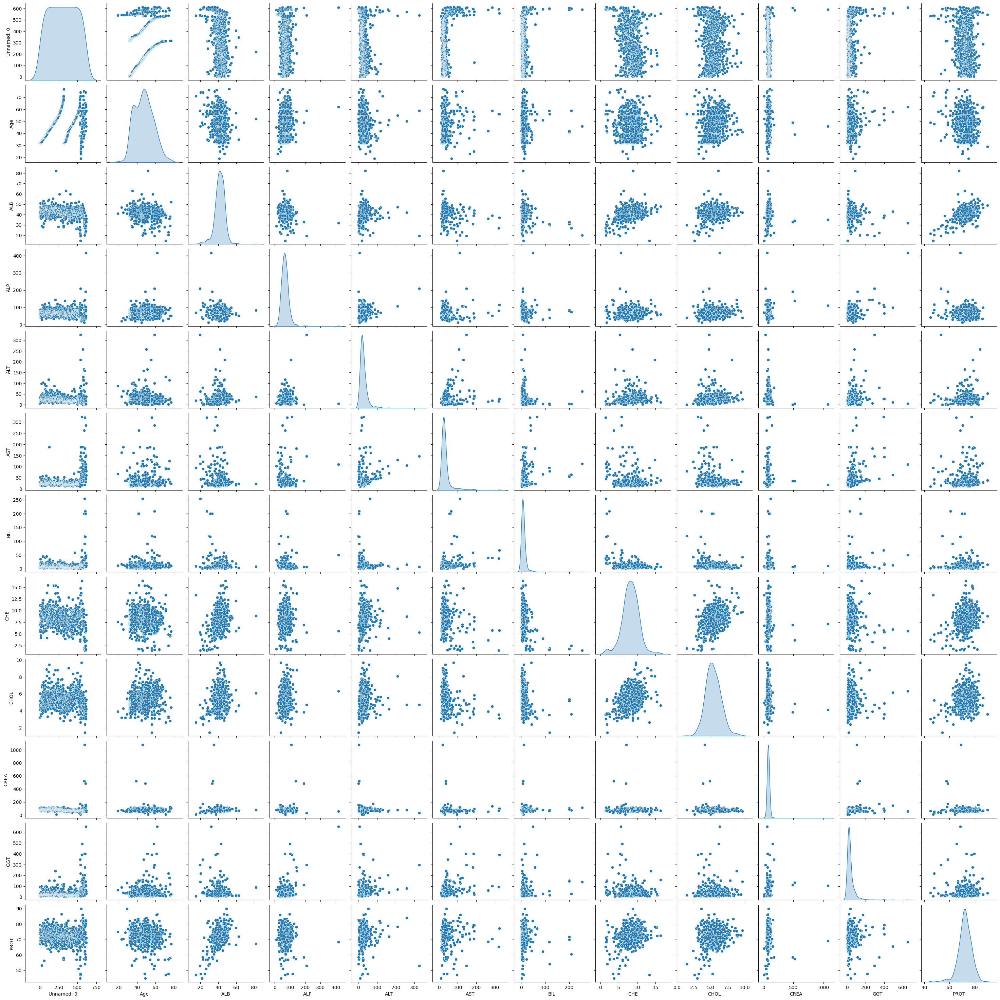

# Laporan Proyek Machine Learning - Fatikha Hudi Aryani

## Domain Proyek

Hepatitis C adalah penyakit menular yang menyerang hati dimana disebabkan oleh virus Hepatitis C (HCV). Secara umum apabila dibandingkan dengan hepatitis golongan lain, hepatitis C termasuk golongan penyakit hepatitis ganas yang mengakibatkan gangguan fungsi hati secara kronis dan sering kali berdampak pada kematian [[1](https://journal.isas.or.id/index.php/JACOST/article/view/556/234)]. Penyakit ini menjadi salah satu masalah kesehatan global dengan dampak yang signifikan. Berdasarkan data tahun 2019, terdapat sekitar 185 juta orang di seluruh dunia yang hidup dengan hepatitis C, di mana 58 juta kasus di antaranya merupakan infeksi kronis, termasuk 3,2 juta kasus pada anak-anak dan remaja. Setiap tahunnya, sekitar 1,5 juta kasus infeksi baru hepatitis C terdeteksi. Berbeda dengan hepatitis A dan B, hepatitis C memiliki tingkat mortalitas tertinggi, yaitu 5 kematian per 100.000 pasien. Dampak serius dari penyakit ini terlihat pada komplikasinya, seperti sirosis hati dan hepatocellular carcinoma (HCC), yang menyebabkan sekitar 290.000 kematian global pada tahun 2019 menurut laporan WHO [[2](https://www.alomedika.com/penyakit/gastroenterologi/hepatitis-c/epidemiologi)].

Peningkatan angka mortalitas yang signifikan menjadikan deteksi dini dan pengelolaan penyakit hepatitis C menjadi prioritas utama dalam bidang kesehatan. Data menunjukkan bahwa sirosis hepar, salah satu komplikasi utama hepatitis C, memiliki tingkat kematian sebesar 4% per tahun [[3](https://pedulihatibangsa.id/2024/06/08/laporan-who-mengungkapkan-peningkatan-kematian-global-akibat-virus-hepatitis/)]. Untuk itu, analisis data klinis yang komprehensif menjadi langkah penting dalam memahami pola penyakit ini dan mendukung pengambilan keputusan medis. Dengan memanfaatkan dataset klinis hepatitis C, seperti yang tersedia di Kaggle, dapat dilakukan pengembangan model prediktif dan eksplorasi faktor risiko untuk mengidentifikasi pasien dengan potensi komplikasi serius, sehingga upaya pencegahan dan pengobatan dapat lebih terarah dan efektif.


### Mengapa dan Bagaimana Masalah tersebut Harus Diselesaikan?

Mengingat Hepatitis C merupakan ancaman serius bagi kesehatan masyarakat global karena dapat berkembang menjadi komplikasi berat seperti sirosis dan hepatocellular carcinoma (HCC). Selain itu, angka infeksi baru yang tinggi, yaitu 1,5 juta kasus per tahun, menambah beban kesehatan global, khususnya di negara-negara berkembang dengan akses terbatas ke diagnosis dan pengobatan. Jika tidak ditangani, hepatitis C akan terus meningkatkan beban ekonomi akibat biaya pengobatan dan hilangnya produktivitas pasien. Penanganan yang tepat dapat mencegah penyebaran penyakit ke tahap yang lebih parah, sehingga dapat menurunkan angka mortalitas (kematian) dan meningkatkan kualitas hidup pasien. 

Masalah ini dapat diselesaikan melalui kombinasi upaya pencegahan, deteksi dini, dan pengelolaan kasus yang efektif. Pertama, edukasi masyarakat tentang cara pencegahan infeksi, seperti penghindaran risiko penularan. Kedua, penggunaan teknologi analitik berbasis data, seperti analisis dataset klinis hepatitis C, memungkinkan pengembangan model prediktif untuk mengidentifikasi faktor risiko dan mendeteksi pasien dengan potensi komplikasi. Dengan model prediktif yang akurat, dapat menghasilkan analisa kesehatan yang dapat membantu mendeteksi pasien berisiko tinggi dan memprioritaskan pengobatan. Pendekatan ini tidak hanya meningkatkan efisiensi diagnosis dan pengobatan tetapi juga memungkinkan langkah-langkah preventif yang lebih efektif dan mengendalikan penyebaran hepatitis.

### Hasil Riset Terkait 
- [Analisis SMOTE Pada Klasifikasi Hepatitis C Berbasis Random Forest dan Naïve Bayes](https://pdfs.semanticscholar.org/a9b1/1c791d1218c708b9331ffca0336ae59c2111.pdf) oleh Nabilah dan Nur (2023), yang menunjukkan bahwa metode prediksi Hepatitis C dengan menggunakan model Random Forest mampu menangani outlier dan imbalance data. Selain itu, keunggulan lainnya yaitu meningkatkan akurasi prediksi secara signifikan dan dapat mengidentifikasi fitur-fitur yang penting. Model ini menangani pola kompleks dalam data hepatitis C, sehingga efektif untuk membantu dalam mengidentifikasi pasien yang terindikasi memiliki tingkat risiko tinggi dan dapat bermanfaat untuk upaya preventing.
- [Penerapan Random Forest Untuk Prediksi Virus Hepatitis C](https://ejournal.katersipublisher.com/index.php/FIMERKOM/article/view/48/15) oleh Ahmad Rozy (2024), menunjukkan bahwa algoritma Random Forest memberikan akurasi tinggi dalam mendeteksi Hepatitic C Virus (HCV), dimana hasil akurasi, presisi, recall, dan F1-score diatas 90%.  Keunggulan lainnya yaitu terletak pada kemampuannya dalam menangani data medis yang kompleks dan berbagai variasi genetik, serta mencegah overfitting. Dapat disimpulkan bahwa Random Forest sangat efektif untuk memprediksi infeksi HCV dan membantu dalam screening dini. Selain itu dapat membantu penanganan penyakit ini, sekaligus menjadi acuan untuk penelitian lebih lanjut di bidang prediksi  penyakit menggunakan machine learning. 


## Business Understanding

Pada bagian ini, akan menjelaskan proses klarifikasi masalah terkait prediksi penyakit Hepatitis C (HCV) berdasarkan pemeriksaan darah.

### Problem Statements

Berikut adalah pernyataan masalah yang mendasari proyek ini:
1. Bagaimana memprediksi status penyakit Hepatitis C pada pasien berdasarkan data hasil pemeriksaan darah?
2. Parameter apa saja yang paling berpengaruh dalam membedakan status pasien yang menderita penyakit Hepatitis C?
3. Bagaimana mengukur akurasi dan memperkirakan tingkat error yang mungkin terjadi pada hasil prediksi model terbaik dalam mendeteksi pasien yang menderita penyakit Hepatitis C?

### Goals

Berdasarkan rumusan masalah yang telah dipaparkan di atas, maka proyek penelitian ini memiliki tujuan, yaitu:
1. Membangun model prediksi berbasis machine learning yang dapat memberikan diagnosis dini Hepatitis C berdasarkan hasil pemeriksaan darah, yang meliputi kadar ALB (Albumin), ALP (Alkaline Phosphatase), ALT (Alanine Aminotransferase), Aspartate Aminotransferase (AST), BIL (Bilirubin), CHE (Cholinesterase), CHOL (Cholesterol), CREA (Creatinine), GGT (Gamma-Glutamyl Transferase), dan PROT (Protein Total).
2. Mengidentifikasi fitur atau parameter medis yang paling signifikan (feature importance) dalam memprediksi penyakit Hepatitis C?
3. Mengukur akurasi dan memperkirakan tingkat error pada hasil prediksi model terbaik dengan menggunakan metrik evaluasi.


### Solution Statements

Berdasarkan tujuan yang telah dipaparkan diatas, maka proyek penelitian ini memiliki solusi atau tahapan sebagai berikut:
- Exploratory Data Analysis (EDA) : Langkah awal yang dilakukan adalah eksplorasi data guna memahami karakteristik dataset, distribusi variabel, proporsi kelas target (Category), dan mendeteksi potensi masalah seperti missing value, outlier, atau data imbalance. Visualisasi statistik deskriptif seperti histogram, boxplot, dan heatmap korelasi akan membantu memahami hubungan antar fitur medis seperti ALT, AST, ALP, Bilirubin, dan Gamma-GT, yang mungkin memiliki peran penting dalam menentukan statistik hepatitis C pada pasien.
- Pengembangan Model : Menggunakan beberapa algoritma machine learning, seperti Random Forest, Logistic Regression, Decision Trees, dan K-Nearest Neighbors untuk membangun model klasifikasi yang dapat memprediksi status Hepatitis C berdasarkan data medis pemeriksaan darah dan akan dipilih satu model dengan kinerja model terbaik.
- Evaluasi Model : Kinerja model akan dievaluasi menggunakan metrik evaluasi klasifikasi yang umum digunakan agar performa dapat dibandingkan secara objektif, seperti akurasi, precision, recall, dan F1-score. Dengan metrik evaluasi akan membantu dalam memilih model terbaik berdasarkan hasil prediksi yang paling optimal.


## Data Understanding

Dataset dapat diunduh di : [Hepatitis C Dataset](https://www.kaggle.com/datasets/fedesoriano/hepatitis-c-dataset)

Dataset yang digunakan dalam proyek ini merupakan [Hepatitis C Dataset](https://www.kaggle.com/datasets/fedesoriano/hepatitis-c-dataset) yang diperoleh dari Kaggle. Dataset tersebut berisi informasi medis mengenai berbagai individu, termasuk data hasil pemeriksaan darah yang digunakan untuk mendiagnosis Hepatitis C. Terdiri dari 615 records data dimana didalamnya berisi 14 fitur. Dataset ini digunakan untuk memprediksi apakah seorang pasien menderita Hepatitis C berdasarkan beberapa fitur atau parameter hasil pemeriksaan darah, informasi jenis kelamin, dan usia individu. Dataset ini digunakan dengan tujuan untuk mengklasifikasikan individu menjadi dua kategori yaitu Hepatitis (Abnormal) dan Non-hepatitis (Normal).

### Variabel-variabel pada Hepatitis C Dataset sebagai berikut:
- Unnamed : merupakan nomor baris/id unik yang mengidentifikasi setiap subjek.
- Category : tipe pasien (0 = Donor Darah, 1 = Hepatitis, 2 = Fibrosis, 3 = Sirosis, 0s = Dugaan Donor Darah).
- Age : umur pasien.
- Sex : merupakan jenis kelamin individu (m = Laki-laki, f = Perempuan).
- ALB : Albumin Blood Test merupakan protein darah yang mengindikasikan kesehatan hati dan ginjal.
- ALP : Alkaline Phosphatase merupakan enzim untuk mendeteksi gangguan hati, tulang, atau empedu.
- ALT : Alanine Transaminase merupakan enzim spesifik penanda kerusakan sel hati.
- AST : Aspartate Transaminase merupakan enzim yang menandai kerusakan hati atau jantung.
- BIL : Bilirubin merupakan zat sisa pemecahan sel darah merah, penanda fungsi hati.
- CHE : Acetylcholinesterase merupakan enzim yang mencerminkan kemampuan sintesis protein hati.
- CHOL : Cholesterol merupakan kadar kolesterol total dalam darah, terkait kesehatan hati dan jantung.
- CREA : Creatinine merupakan produk sisa metabolisme otot yang menunjukkan fungsi ginjal.
- GGT : Gamma-Glutamyl Transferase merupakan enzim hati yang sensitif terhadap gangguan saluran empedu atau kerusakan akibat alkohol.
- PROT : Protein Total merupakan kadar protein darah secara keseluruhan, mencerminkan fungsi hati dan status nutrisi.

### Informasi Dataset
| No | Kolom       | Non-Null Count | Tipe Data |
|----|-------------|----------------|-----------|
| 1  | Unnamed: 0  | 615            | int64     |
| 2  | Category    | 615            | object    |
| 3  | Age         | 615            | int64     |
| 4  | Sex         | 615            | object    |
| 5  | ALB         | 614            | float64   |
| 6  | ALP         | 597            | float64   |
| 7  | ALT         | 614            | float64   |
| 8  | AST         | 615            | float64   |
| 9  | BIL         | 615            | float64   |
| 10 | CHE         | 615            | float64   |
| 11 | CHOL        | 605            | float64   |
| 12 | CREA        | 615            | float64   |
| 13 | GGT         | 615            | float64   |
| 14 | PROT        | 614            | float64   |

### Statistik Deskriptif pada Kolom Numerik


### Pengecekan Missing Value
Langkah pertama yang perlu dilakukan yaitu memeriksa apakah terdapat data yang hilang (missing values) pada setiap fitur atau tidak. Apabila terdapat nilai yang hilang pada fitur penting, imputasi dilakukan menggunakan median atau mean (untuk fitur numerik). Namun apabila jumlahnya sangat sedikit, baris yang memiliki missing values dapat dihapus tanpa mempengaruhi kualitas dataset. Penanganan missing values diperlukan karena data yang hilang dapat mengurangi kualitas model dan menyebabkan bias dalam prediksi. Dengan imputasi atau penghapusan missing values, dataset menjadi lebih konsisten dan memungkinkan model untuk belajar dengan lebih baik.

Untuk pengecekan missing values, dapat menggunakan kode berikut:

```python
# Menghitung dan menampilkan nilai NaN
missing_df = df.isna().sum()  # Menampilkan jumlah NaN per kolom
print(missing_df)
```


Dari informasi diatas dapat disimpulkan bahwa terdapat missing value pada kolom ALB, ALT,dan PROT masing-masing kolom terindikasi ada 1 missing value, sedangkan pada kolom ALP ada 18 missing value dan kolom CHOL terdapat 10 jumlah missing value.

### Pengecekan Data Duplikat
Langkah selanjutnya yaitu memeriksa apakah terdapat data duplikat di dalam dataset. Data duplikat bisa saja terjadi akibat kesalahan saat pengumpulan atau proses input data.

Untuk memeriksa data duplikat, dapat menggunakan kode berikut:
```python # Memeriksa duplikasi data 
df_duplicate = df.duplicated().sum()
print(f"Jumlah baris duplikat: {df_duplicate}")
```


Dalam dataset ini, saat dilakukan pengecekan tidak terdapat adanya data duplikat sehingga tidak diperlukan penanganan data duplikat.

### Pengecekan Outlier
Langkah yang selanjutnya yaitu memeriksa apakah terdapat outlier di dalam dataset. Dalam mendeteksi adanya outlier atau nilai ekstrem, digunakan teknik boxplot dan Interquartile Range (IQR) untuk mengidentifikasi data yang berada di luar batas normal distribusi dan akan divisualisasikan ke dalam boxplot. Penanganan outlier perlu dilakukan karena outlier dapat menjadi nilai yang ekstrem dan tidak biasa yang dapat mempengaruhi hasil analisis statistik dan model prediksi. Dengan memperhatikan IQR dan melihat visualisasi boxplot, kita dapat menentukan batas atas dan batas bawah untuk outlier, serta mengambil tindakan yang tepat, seperti menghapus atau mengelola outlier tersebut, agar tidak mempengaruhi hasil analisis secara signifikan.


Berdasarkan hasil dari perhitungan outlier dengan menggunakan metode Interquartile Range (IQR), terlihat bahwa hanya ada satu kolom yang tidak ditemukan adanya outlier yaitu pada kolom sex. Kolom lainnya (ALB, ALP, ALT, AST, BIL, CHE, CHOL, CREA, GGT, PROT) terlihat adanya outlier sehingga perlu untuk dilakukan penanganan outlier pada tahap selanjutnya.

## Exploratory Data Analysis

### 1. Univariate Analysis
- **Analisis Distribusi Data Kategorikal**
  

  Dari hasil diatas, dapat dilihat bahwa terdapat lebih banyak individu berjenis kelamin Male (laki-laki) daripada Female (perempuan), dimana jumlah male yang jauh lebih dominan. Sedangkan, distribusi Category menunjukkan bahwa kategori normal (individu yang sehat) jauh lebih dominan dibandingkan dengan kategori abnormal (individu yang memiliki penyakit hati seperti hepatitis, fibrosis, dan sirosis). Hal ini mengindikasikan bahwa jumlah individu yang memiliki penyakit hepatitis, sirosis, dan fibrosis jauh lebih sedikit.
  
- **Analisis Distribusi Data Numerik**
  

  Berdasarkan grafik histogram dari fitur numerik dalam dataset Hepatitis C, berikut adalah beberapa informasi yang diperoleh:

1. **Distribusi Usia (Age):** Data usia pasien tersebar dalam rentang 20–80 tahun, dengan konsentrasi tertinggi pada usia 30–50 tahun. Distribusi ini menunjukkan bahwa kebanyakan pasien berada pada usia produktif hingga menjelang lansia.
2. **Distribusi Fitur Klinis:**
   * **ALB, CHE, CHOL, dan PROT** menunjukkan distribusi yang relatif mendekati normal, dengan bentuk simetris dan puncak yang jelas di tengah rentang data. Ini mengindikasikan variasi nilai yang cukup stabil dalam populasi pasien.
   * **ALP, ALT, AST, BIL, GGT, dan CREA** memiliki distribusi **miring ke kanan (right-skewed)**, menunjukkan adanya **nilai-nilai ekstrem (outliers)** di sisi kanan grafik. Ini umum terjadi pada data medis karena kondisi abnormal biasanya menghasilkan lonjakan nilai.
   * **GGT dan AST** menunjukkan rentang nilai yang sangat lebar, mengindikasikan bahwa fitur ini mungkin sensitif terhadap kondisi patologis yang berat.
3. **Outliers dan Skewness:**
   Banyak fitur seperti **ALT, AST, BIL, GGT, dan CREA** memperlihatkan skewness tinggi dan rentang nilai yang luas. Hal ini mengindikasikan perlunya transformasi atau penanganan outlier untuk meningkatkan performa model prediktif.
4. **Fitur `Unnamed: 0`:** Histogram fitur ini merata dan tidak memiliki arti informatif. Untuk fitur ini akan dihapus pada tahap data preparation karena tidak diperlukan.

**Kesimpulan :**
Sebagian besar fitur medis memiliki distribusi skewed, dimana fitur-fitur dengan distribusi normal (seperti CHE dan PROT) menunjukkan kestabilan dan bisa menjadi indikator tambahan yang berguna dalam pemodelan. Sementara itu, fitur dengan distribusi miring dan outlier tinggi (seperti GGT dan AST) dapat menjadi sinyal penting untuk mengidentifikasi kondisi abnormal seperti Hepatitis C.
  
### 2. Bivariate Analysis

- **Hubungan antara fitur-fitur terhadap fitur target (Category)**
  

  Berdasarkan hasil analisis visualisasi boxplot, terlihat adanya perbedaan distribusi yang mencolok antara kelompok pasien dengan kondisi hati normal dan yang mengalami gangguan/abnormal seperti hepatitis, sirosis, maupun fibrosis. Berikut informasi yang didapatkan dari visualisasi di atas:
   
  1. **ALB (Albumin)**: Parameter ALB (Albumin) menunjukkan bahwa nilai pada kategori Normal memiliki median yang lebih tinggi daripada Abnormal, dengan rentang nilai lebih besar. Terdapat beberapa outlier pada kedua kategori, yang menunjukkan adanya individu dengan nilai ALB yang sangat rendah atau sangat tinggi, serta rentang interkuartil (IQR) cukup sempit, menunjukkan sebagian besar data berada dalam rentang yang stabil.
2. **ALP (Alkaline Phosphatase)**: Nilai ALP pada kategori Abnormal secara umum lebih tinggi daripada Normal. Terlihat banyak outlier pada kategori Abnormal, terutama di nilai yang sangat tinggi, mengindikasikan adanya variabilitas tinggi pada data ini. Dan kategori Abnormal memiliki IQR yang lebih lebar, menunjukkan distribusi data lebih menyebar dibandingkan Normal.
3. **ALT (Alanine Transaminase)**: median ALT lebih tinggi pada kategori Abnormal. dan banyak outlier pada kedua kategori, terutama di nilai tinggi pada Abnormal. Abnormal memiliki rentang distribusi yang jauh lebih lebar dibandingkan Normal.
4. **AST (Aspartate Transaminase)**: nilai AST jauh lebih tinggi pada kategori Abnormal dibandingkan Normal, dan banyak outlier pada kategori Abnormal, tetapi ini dapat menjadi indikasi penting dalam membedakan kondisi. Rentang distribusi sangat lebar pada Abnormal, sementara Normal cenderung lebih terkonsentrasi.
5. **BIL (Bilirubin)**: nilai BIL pada kategori Abnormal jauh lebih tinggi dibandingkan Normal. Terdapat banyak sekali outlier pada kategori Normal, yang menunjukkan beberapa individu memiliki nilai abnormal meskipun tergolong Normal. Abnormal memiliki distribusi yang lebih terpusat dibandingkan Normal.
6. **CHE (Cholinesterase)**: perbedaan antara kategori Normal dan Abnormal kurang signifikan. Beberapa outlier pada kategori Normal dengan nilai sangat tinggi dan distribusi pada kedua kategori cukup tumpang tindih.
7. **CHOL (Cholesterol)**: CHOL pada kategori Normal cenderung lebih tinggi daripada Abnormal, tetapi perbedaan kecil. Ada beberapa outlier, terutama pada kategori Normal. Rentang distribusi data cukup seragam pada kedua kategori.
8. **CREA (Creatinine)**: distribusi CREA hampir sama antara Normal dan Abnormal. Beberapa outlier pada kedua kategori, terutama di nilai tinggi dan rentang distribusi cukup sempit, menunjukkan data ini kurang variabel.
9. **GGT (Gamma-Glutamyl Transferase)**: nilai GGT pada kategori Abnormal jauh lebih tinggi daripada Normal. Banyak outlier pada kategori Abnormal, mengindikasikan adanya individu dengan nilai GGT yang sangat tinggi. Serta, rentang distribusi sangat lebar pada Abnormal.
10. **PROT (Protein Total)**: nilai sedikit lebih tinggi pada Abnormal dibandingkan Normal, tetapi distribusinya cukup tumpang tindih. Beberapa outlier di kedua kategori, tetapi jumlahnya tidak terlalu banyak dan IQR pada kedua kategori relatif serupa.

### Kesimpulan
Fitur-fitur yang paling relevan untuk memprediksi kondisi (Normal atau Abnormal) berdasarkan visualisasi yaitu **BIL**, **AST**, **ALP**, **ALT**, dan **GGT** yang mana memiliki rentang distribusi yang berbeda jelas dan adanya outlier pada Abnormal. Hal ini memperkuat relevansi fitur tersebut untuk prediksi. Sedangkan fitur CHE dan CREA tampaknya kurang relevan karena distribusi antara kategori Normal dan Abnormal cenderung mirip.
  
### 3. Multivariate Analysis
- **Analisis Distribusi Fitur-fitur Numerik dengan Data Kategorikal**
  

  Berdasarkan visualisasi diatas, dapat disimpulkan bahwa parameter AST, BIL, dan GGT menjadi yang paling relevan untuk membedakan kategori normal dan abnormal. Parameter seperti ALB, ALP, CHE, CHOL, CREA dan PROT tidak menunjukkan perbedaan mencolok, sehingga kurang relevan sebagai indikator kondisi patologis.
  
- **Kolerasi Antar Fitur Numerik Menggunakan Fungsi pairplot()**
  
  
- **Kolerasi Fitur Numerik dengan Menggunakan Heatmap Correlation Matrix**
  

  Matriks korelasi diatas menunjukkan bahwa terlihat adanya korelasi positif yang kuat yaitu pada ALB-PROT (0.56), GGT-ALP(0.45), CHE-CHOL (0.43), AST-BIL(0.31), ALT-AST (0.43), CHE-ALB (0.38), dan AST-GGT (0.49). Hal ini menunjukkan bahwa semakin tinggi kadar ALB maka semakin tinggi pula kadar PROT-nya, semakin tinggi kadar CHE maka kemungkinan semakin tinggi pula kadar CHOL-nya, serta semakin tinggi kadar AST maka kemungkinan semakin tinggi pula kadar ALT dan GGT-nya. Korelasi positif yang lemah terlihat beberapa diantaranya yaitu hubungan Age-GGT (0.15), ALP-CREA(0.15), ALT-PROT(0.09), ALT-CHOL(0.07), Age-AST (0.09), dan lainnya. Hal ini menunjukkan bahwa antar fitur memiliki hubungan namun tidak dominan. Korelasi negatif yang lemah terlihat pada BIL-CHE(-0.33), ini berarti jika ALB bertambah, maka kadar CHE cenderung turun sedikit. Korelasi 0 seperti pada ALB-ALT dan ALB-CREA menunjukkan tidak adanya hubungan diantara keduanya.

## Data Preparation
Berikut ini teknik yang digunakan dalam tahap data preparation:

- **Hapus Kolom yang Tidak Diperlukan**

Karena kolom Unnamed:0 tidak diperlukan dalam analisis pada tahap selanjutnya, maka kita perlu drop kolom tersebut dengan menggunakan fungsi drop().

```python # Menghapus kolom yang tidak diperlukan 
df = df.drop(['Unnamed: 0'], axis=1)
```

- **Penanganan Missing Value**

  Berikut kode yang digunakan untuk menangani missing value:
  ```python # Mengisi missing value dengan nilai mean
  def fill_selected_missing_with_mean(df, columns):
      for col in columns:
          df[col] = df[col].fillna(df[col].mean())
      return df
  
  selected_columns = ['ALB', 'ALP', 'ALT', 'CHOL', 'PROT']
  df = fill_selected_missing_with_mean(df, selected_columns)
  print(df.isnull().sum())
  ```

  

- **Penanganan Outlier**

  Dalam tahap ini, penanganan outlier dilakukan dengan menggunakan teknik winsorization untuk membatasi nilai ekstrem (outlier) pada fitur numerik yang meliputi data medis. Penerapan ini digunakan untuk meningkatkan stabilitas dan performa model. Winsorization adalah teknik statistik yang digunakan untuk mengurangi pengaruh outlier (nilai ekstrem) dalam data numerik dengan mengganti nilai ekstrem tersebut dengan nilai batas tertentu sehingga mengurangi skewness (kemencengan data).

  Untuk menangani outlier, dapat menggunakan kode berikut:
  ```python # Daftar kolom yang akan diproses
  columns_to_winsorize = ['ALB', 'ALP', 'ALT', 'AST', 'BIL', 'CHE', 'CHOL', 'CREA', 'GGT', 'PROT']
  
  for col in columns_to_winsorize:
      # Hitung batas IQR
      Q1 = df[col].quantile(0.25)
      Q3 = df[col].quantile(0.75)
      IQR = Q3 - Q1
      upper = Q3 + 1.5 * IQR
      lower = Q1 - 1.5 * IQR
  
      # Terapkan winsorization
      df.loc[df[col] > upper, col] = upper  # Ganti outlier atas
      df.loc[df[col] < lower, col] = lower  # Ganti outlier bawah
  
  # Verifikasi
  print("Jumlah outlier yang ditangani per kolom:")
  for col in columns_to_winsorize:
      original_count = len(df) - df[col].between(lower, upper).sum()
      print(f"{col}: {original_count} nilai di luar batas IQR")
  ```
  Dan setelah dilakukan penanganan outlier dengan teknik winsorization, terlihat tiap fitur numerik yang terdapat outlier telah berhasil ditangani:
  
  

- **Encoding Fitur Kategoris**

  Langkah selanjutnya yaitu encoding fitur kategoris, dimana tahapan ini merupakan proses mengubah nilai dalam kolom kategorikal (seperti jenis kelamin dan kategori) menjadi bentuk numerik agar dapat diproses oleh algoritma machine learning.
  
  Berikut kode yang digunakan untuk encoding:
  ```python # Mengubah nilai di DataFrame untuk Gender dan Category menjadi Numerikal
  df['Sex'] = df['Sex'].replace({'m': 0, 'f': 1})
  df['Category'] = df['Category'].replace({'Normal' : 0, 'Abnormal': 1})
  ```
  
   
  
- **Data Splitting**

  Dataset akan dibagi menjadi dua set yaitu data training dan testing (dengan proporsi 80:20). Data training akan digunakan untuk melatih model, sedangkan untuk data testing akan digunakan untuk mengevaluasi kinerja dari model yang sudah dibangun. Splitting data ini penting untuk menghindari overfitting dan memastikan model dapat diuji pada data yang tidak digunakan selama proses pelatihan. Splitting data diperlukan agar proses transformasi hanya dilakukan pada data training saja. Data testing harus berperan sebagai data baru yang tidak terpengaruh oleh proses pelatihan, untuk menilai bagaimana model bekerja pada data yang belum pernah dilihat sebelumnya.

  

  Jumlah data keseluruhan sebanyak 615 data, untuk data pelatihan terdapat sebanyak 492 data, sedangkan untuk data uji sebanyak 123 data.
  
- **Penanganan Imbalance Data**

  Pada tahap EDA (Exploratory Data Analysis), diketahui terdapat ketidakseimbangan kelas pada kolom Category (Normal dan Abnormal). Oleh karena itu, perlu dilakukan penanganan untuk menyeimbangkan kelas menggunakan SMOTE(Synthetic Minority Over-sampling Technique). Penanganan imbalance data dilakukan dengan teknik SMOTE, yaitu metode yang membuat data sintetik pada kelas minoritas agar distribusi kelas menjadi lebih seimbang tanpa sekadar menduplikasi data. Dalam tahap ini, SMOTE diterapkan hanya pada data training dengan target keseimbangan 80%, kemudian divisualisasikan untuk membandingkan distribusi kelas sebelum dan sesudah dilakukan oversampling.

  Berikut ini adalah tampilan dari perbandingan data sebelum dan setelah dilakukan penerapan SMOTE:
  
  Setelah dilakukan SMOTE (Synthetic Minority Oversampling Technique), terlihat bahwa data antara normal dan abnormal menjadi lebih seimbang dibandingkan sebelumnya.

- **Standarisasi**

  Tahapan standarisasi data dilakukan dengan menggunakan StandardScaler, yang mengubah skala setiap fitur agar memiliki rata-rata 0 dan standar deviasi 1, sehingga semua fitur berada dalam skala yang seragam. Proses ini dilakukan hanya pada data training (fit & transform), sedangkan data testing hanya ditransformasikan menggunakan scaler yang sama agar menghindari kebocoran data.
  
  
- **Reduksi Dimensi dengan PCA (Principal Component Analysis)**

  Principal Component Analysis (PCA) merupakan teknik reduksi dimensi yang digunakan untuk merangkum informasi dari banyak fitur menjadi beberapa komponen utama yang paling menjelaskan variasi data. Dalam visualisasi ini, PCA digunakan untuk memproyeksikan data ke dalam dua dimensi (PCA1 dan PCA2), sehingga pola antar kategori dapat lebih mudah diamati secara visual.
  


## Modelling
Pada tahap ini, dilakukan proses pembangunan model dengan menerapkan beberapa algoritma machine learning untuk memprediksi status infeksi penyakit Hepatitis C. Algoritma yang digunakan meliputi Random Forest (RF), Decision Tree (DT), Logistic Regression (LR), serta K-Nearest Neighbors (KNN), yang dipilih karena masing-masing mewakili pendekatan berbeda dalam klasifikasi, mulai dari model ensamble hingga model linier dan berbasis jarak.

Sebagai langkah awal, seluruh model dikembangkan dengan menggunakan konfigurasi default dari library scikit-learn, yakni RandomForestClassifier, DecisionTreeClassifier, LogisticRegression, dan KNeighborsClassifier. Proses pelatihan dilakukan terhadap data training yang telah melalui proses standarisasi dan oversampling (menggunakan SMOTE), yaitu X_train_scaled dan y_train_resampled dan tanpa melakukan perubahan apapun pada parameter model. Ini bertujuan untuk mendapatkan baseline performance atau kinerja dasar model tanpa optimasi parameter. Baseline ini berfungsi sebagai titik awal pembanding untuk mengetahui seberapa besar peningkatan performa setelah optimasi dilakukan.

Berikut adalah penjelasan mengenai tiap algoritma pemodelan yang akan digunakan:
### 1. Model Random Forest (RF)


**Random Forest** merupakan algoritma machine learning berbasis ensemble learning yang membangun banyak decision tree saat pelatihan dan menggabungkan prediksi dari semua tree untuk menghasilkan output yang lebih akurat dan stabil.

Berikut ini adalah kode yang digunakan untuk melatih model:

```rf = RandomForestClassifier().fit(X_train_scaled, y_train_resampled)```

**Tahapan**

Adapun tahapan dari algoritma Random Forest sebagai berikut:
- Dataset dibagi menjadi beberapa subset menggunakan teknik bootstrap sampling (pengambilan sampel acak dengan pengembalian).
- Setiap subset digunakan untuk membangun satu decision tree.
- Pada setiap node dalam tree, dipilih subset fitur acak untuk pemisahan (split) terbaik.
- Proses ini dilakukan hingga tree selesai dibentuk (tanpa pruning).
- Untuk klasifikasi, hasil akhir diambil berdasarkan mayoritas vote dari semua pohon (bagging).

**Parameter yang Digunakan**

Adapun parameter yang digunakan dari pemodelan ini yaitu meliputi:
- n_estimators: Jumlah pohon (decision trees) dalam hutan (forest).
- max_depth: Kedalaman maksimum pohon.
- min_samples_split: Jumlah minimum sampel yang dibutuhkan untuk membelah sebuah node.
- min_samples_leaf: Jumlah minimum sampel yang harus ada di daun (leaf node).
  
**Kelebihan**
- Akurat dan tahan terhadap overfitting (karena averaging).
- Dapat menangani data yang besar dan memiliki banyak fitur.
- Mendukung pengukuran feature importance.
- Tidak sensitif terhadap data missing atau outlier kecil.

**Kekurangan**
- Kurang interpretatif dibanding decision tree tunggal.
- Waktu pelatihan dan prediksi lebih lama (terutama jika banyak tree).
- Tidak cocok untuk data real-time dengan kebutuhan prediksi cepat.

### 2. Model Decision Tree (DT)


**Decision Tree** adalah algoritma pemodelan berbasis pohon keputusan yang membagi dataset menjadi kelompok berdasarkan aturan logika sederhana yang diambil dari fitur data.

Berikut ini adalah kode yang digunakan untuk melatih model:

```dt = DecisionTreeClassifier().fit(X_train_scaled, y_train_resampled)```

**Tahapan**

Adapun tahapan dari algoritma Decision Tree sebagai berikut:
- Dimulai dari seluruh data (root node).
- Memilih fitur yang memberikan information gain terbaik (atau Gini, entropy) untuk membagi data.
- Membuat cabang berdasarkan nilai fitur tersebut.
- Proses berulang hingga kondisi stopping terpenuhi (misal: semua data di cabang sama, atau maksimal kedalaman tercapai).
- Setiap cabang akhir (leaf) berisi prediksi kelas.
  
**Parameter yang Digunakan**

Adapun parameter yang digunakan dari pemodelan ini yaitu meliputi:
- max_depth: Kedalaman maksimum pohon.
- criterion: Fungsi untuk mengukur kualitas pembagian (misalnya, "gini" atau "entropy").
gini: Menggunakan Gini Impurity untuk mengukur ketidakmurnian kelas.
entropy: Menggunakan Information Gain berdasarkan entropi dan jika ingin pembelahan lebih presisi (khususnya untuk data dengan banyak kelas).
- min_samples_split: Jumlah minimum sampel yang dibutuhkan untuk membelah sebuah node.
- min_samples_leaf: Jumlah minimum sampel yang harus ada di daun (leaf node).

**Kelebihan**
- Mudah diinterpretasikan dan divisualisasikan.
- Tidak membutuhkan normalisasi data.
- Dapat menangani data kategorikal dan numerik.
- Cepat dalam pelatihan dan prediksi.

**Kekurangan**
- Sangat rentan terhadap overfitting.
- Sensitif terhadap perubahan kecil dalam data (menghasilkan struktur tree yang berbeda).
- Tidak stabil jika fitur tidak relevan tidak disaring terlebih dahulu.

### 3. Model Logistic Regression (LR)


**Logistic Regression** merupakan model statistik untuk klasifikasi biner atau multikelas yang memprediksi probabilitas suatu kelas berdasarkan fungsi logistik (sigmoid).

Berikut ini adalah kode yang digunakan untuk melatih model:

```lr = LogisticRegression().fit(X_train_scaled, y_train_resampled)```

**Tahapan**

Adapun tahapan dari algoritma Logistic Regression sebagai berikut:
- Menghitung kombinasi linier dari fitur input dan bobot.
- Menerapkan fungsi sigmoid untuk mengubah nilai linier menjadi probabilitas antara 0 dan 1.
- Kelas diprediksi berdasarkan ambang batas (biasanya 0.5).
- Proses pelatihan dilakukan dengan meminimalkan log-loss menggunakan optimasi seperti Gradient Descent.

**Parameter yang Digunakan**

Adapun parameter yang digunakan dari pemodelan ini yaitu meliputi:
- penalty: Jenis regulasi yang digunakan untuk menghindari overfitting (L1, L2).
- C: Parameter untuk kontrol regulasi.
- solver: Algoritma untuk optimasi (misalnya, "liblinear" atau "saga").

**Kelebihan**
- Cepat dan efisien pada dataset besar.
- Mudah diinterpretasikan (berbasis koefisien fitur).
- Cocok sebagai baseline model.
- Dapat menghasilkan probabilitas prediksi.

**Kekurangan**
- Tidak cocok untuk masalah non-linear kecuali dipadukan dengan transformasi fitur.
- Rentan terhadap overfitting jika banyak fitur dan tidak ada regularisasi.
- Kurang fleksibel dibanding model non-linier seperti tree atau SVM.


### 4. Model K-Nearest Neighbor (KNN)


**K-Nearest Neighbor** merupakan algoritma non-parametrik yang mengklasifikasikan data berdasarkan kedekatannya (jarak) dengan k tetangga terdekat dalam data training.

Berikut ini adalah kode yang digunakan untuk melatih model:

```knn = KNeighborsClassifier().fit(X_train_scaled, y_train_resampled)```

**Tahapan**

Adapun tahapan dari algoritma K-Nearest Neighbor sebagai berikut:
- Hitung jarak antara data uji dan semua data training (umumnya dengan Euclidean distance).
- Pilih k data training dengan jarak terdekat.
- Tentukan kelas berdasarkan mayoritas dari k tetangga tersebut.
- Prediksi dilakukan berdasarkan hasil voting.

**Parameter yang Digunakan**

Adapun parameter yang digunakan dari pemodelan ini yaitu meliputi:
- n_neighbors: Jumlah tetangga terdekat yang digunakan untuk klasifikasi.
- metric: Metrik jarak yang digunakan untuk menghitung kedekatan (misalnya, "euclidean").
- weights: Metode pembobotan tetangga (uniform atau distance).

**Kelebihan**
- Sederhana dan mudah dipahami.
- Tidak ada proses pelatihan yang kompleks.
- Sangat fleksibel terhadap bentuk distribusi data.

**Kekurangan**
- Lambat saat prediksi (terutama pada dataset besar).
- Sensitif terhadap skala data dan fitur irrelevant.
- Memori intensif karena menyimpan seluruh data training.

### Pemilihan Model Terbaik
Random Forest (RF) merupakan pilihan terbaik untuk menghasilkan model dengan performa optimal untuk menangani dataset hepatitis c. Pemilihan ini didasarkan pada karakteristik algoritma yang sangat sesuai dengan struktur dan kompleksitas dataset. Random Forest memiliki keunggulan yang dapat menghasilkan akurasi yang akurat dan hasil yang stabil karena menerapkan teknik ensemble learning, dimana menggabungkan banyak pohon keputusan untuk mengurangi risiko overfitting. Selain itu, model ini mampu menangani hubungan non-linear antar fitur, memberikan informasi penting melalui feature importance, dan tidak bergantung pada skala data, sehingga tidak memerlukan proses standarisasi yang rumit. Keunggulan lainnya adalah kemampuannya dalam menghadapi data yang hilang dan tetap menunjukkan performa konsisten meskipun ukuran dataset tergolong kecil (615 data). Namun, meskipun model Random Forest memiliki banyak keunggulan, hasil evaluasi model tetap harus diperhatikan untuk memastikan bahwa model ini memberikan performa yang optimal, dengan memeriksa metrik seperti accuracy, precision, recall, dan F1-score.


## Evaluation
Pada tahap ini, dilakukan evaluasi terhadap model yang telah dilatih untuk mengukur performa model dengan menggunakan metrik evaluasi. Evaluasi dilakukan berdasarkan empat metrik utama yang meliputi Akurasi, Precision, Recall, dan F1-Score. Metrik tersebut dipilih karena relevansinya dalam konteks masalah klasifikasi biner yang ada pada proyek ini, yaitu memprediksi apakah individu termasuk kedalam kategori menderita Hepatitis C atau tidak. Berikut adalah penjelasan dan hasil dari evaluasi:

### Accuracy
**Accuracy** merupakan metrik yang digunakan untuk mengukur proporsi prediksi yang benar dari seluruh prediksi yang dilakukan. Ini adalah metrik paling umum untuk menilai performa model klasifikasi. 
  
**Formula Metrik**

Accuracy dihitung menggunakan rumus berikut:


Keterangan:
- **TP**: True Positive (prediksi positif yang benar)
- **TN**: True Negative (prediksi negatif yang benar)
- **FP**: False Positive (prediksi positif yang salah)
- **FN**: False Negative (prediksi negatif yang salah)
  
**Interpretasi**

Semakin tinggi nilai accuracy (mendekati 1 atau 100%), maka semakin baik performa model secara keseluruhan. Namun, accuracy bisa menyesatkan jika data tidak seimbang (imbalanced), karena model bisa terlihat baik hanya karena memprediksi mayoritas kelas.

### Precision
**Precision** merupakan metrik yang digunakan untuk mengukur berapa banyak dari seluruh prediksi positif yang benar-benar positif. Ini penting ketika biaya dari kesalahan false positive tinggi.

**Formula Metrik**

Precision dihitung menggunakan rumus berikut:


Keterangan:
- **TP**: True Positive
- **FP**: False Positive

**Interpretasi**

Nilai precision yang tinggi menunjukkan bahwa model jarang salah mengklasifikasikan data negatif sebagai positif. Precision yang tinggi berarti model dapat mengidentifikasi individu yang benar-benar menderita Hepatitis C dengan baik, menghindari prediksi yang salah terhadap individu yang sehat. Ini sangat penting ketika tujuan adalah meminimalkan false positives, misalnya, untuk menghindari pemberian diagnosis yang salah.

### Recall
**Recall** merupakan metrik untuk mengukur berapa banyak dari seluruh kasus positif yang berhasil terdeteksi dengan benar oleh model. Ini penting ketika biaya dari kesalahan false negative tinggi.

**Formula Metrik**

Recall dihitung menggunakan rumus berikut:


Keterangan:
- **TP**: True Positive
- **FN**: False Negative
  
**Interpretasi**

Nilai recall yang tinggi berarti model berhasil menangkap sebagian besar data positif, meskipun mungkin menghasilkan false positive lebih banyak. Ini sangat penting dalam diagnosis medis, di mana melewatkan kasus positif bisa berbahaya dan juga lebih penting untuk menangkap semua pasien yang menderita Hepatitis C (mencegah false negatives) daripada menghindari beberapa false positives.

### F1-Score
**F1-Score** merupakan rata-rata harmonis antara precision dan recall, yang digunakan untuk menyeimbangkan kedua metrik ketika penting untuk mempertimbangkan keduanya.

**Formula Metrik**

F1-Score dihitung menggunakan rumus berikut:


Keterangan:
- **Precision**: Proporsi prediksi positif yang benar.
- **Recall**: Proporsi kejadian positif yang berhasil terdeteksi.

**Interpretasi**

F1-Score memberikan ukuran keseimbangan antara kesalahan tipe I (false positive) dan tipe II (false negative). Nilai F1 mendekati 1 menunjukkan model yang baik secara keseluruhan, terutama dalam kondisi data tidak seimbang. F1-Score yang baik menunjukkan bahwa model tidak hanya akurat dalam memprediksi penyakit Hepatitis C tetapi juga berhasil mendeteksi sebagian besar individu yang benar-benar menderita Hepatitis C, yang sangat penting dalam konteks medis.

### Metrik MSE
**Mean Squared Error (MSE)** adalah salah satu metrik evaluasi yang digunakan untuk mengukur rata-rata kesalahan kuadrat antara nilai yang diprediksi oleh model dan nilai aktual. MSE sangat umum digunakan dalam permasalahan regresi dan memberikan gambaran seberapa jauh prediksi model menyimpang dari nilai sebenarnya.

**Formula Metrik**

 Metrik MSE dihitung menggunakan rumus berikut:


Keterangan :

 

**Interpretasi**

Nilai MSE lebih kecil menunjukkan bahwa prediksi model lebih mendekati nilai aktual. Karena kesalahan dikuadratkan, MSE lebih sensitif terhadap outlier. Artinya, kesalahan besar akan memberikan kontribusi lebih besar terhadap nilai akhir MSE. MSE tidak bisa bernilai negatif, karena hasil kuadrat selalu positif atau nol. Dalam konteks evaluasi model, semakin rendah nilai MSE, maka semakin baik kinerja model dalam melakukan prediksi.


## Result
### Analisa Hasil Metrik Evaluasi
Setelah melakukan training model dan evaluasi model, hasil yang didapatkan menunjukkan performa model yang beragam tergantung pada algoritma yang digunakan. Namun, setelah dilakukan proses tuning hyperparameter, hasil evaluasi menunjukkan tidak adanya peningkatan signifikan dibandingkan performa model sebelum tuning, baik pada metrik akurasi, precision, recall, maupun F1-score. Hal ini mengindikasikan bahwa parameter default yang digunakan sebelumnya sudah cukup optimal.


Dari evaluasi terhadap keempat model, berikut adalah ringkasan metrik evaluasi untuk model yang diuji **sebelum dilakukan hyperparameter tuning**:


**1. Random Forest (RF):**

Random Forest memberikan hasil yang sangat baik dalam mendeteksi hepatitis c, dengan akurasi dan recall yang tinggi. Model ini berhasil mendeteksi sebagian besar individu yang menderita Hepatitis C, disamping itu juga mampu mempertahankan tingkat kesalahan prediksi yang rendah (false positives rendah). 

**2. Decision Tree (DT):**

Decision Tree bisa lebih rentan terhadap overfitting dibandingkan dengan Random Forest karena tidak menggunakan ensemble learning, yang dapat membatasi kemampuan model untuk men-generalisasi pada data baru (risiko overfitting karena single-tree structure) Konsistensi dalam precision-recall, tetapi tidak ideal untuk deteksi kasus prediksi medis.

**3. Logistic Regression (LR):**

Logistic Regression memberikan hasil yang solid, tetapi model ini menunjukkan kinerja yang lebih rendah dibandingkan dengan Random Forest dan KNN, terutama dalam Recall (0.959), yang berarti model ini sedikit lebih sering melewatkan individu yang masuk ke dalam kategori penderita Hepatitis C (setiap 100 penderita, ~4 orang terlewat (false negatives)

**4. K-Nearest Neighbors (KNN):**

KNN memberikan hasil precison dan Recall yang seimbang. Namun, KNN menunjukkan hasil yang lebih rendah dibandingkan dengan model random forest, yang mengindikasikan bahwa KNN kurang optimal dan cenderung lebih sering melewatkan individu yang masuk ke dalam kategori penderita Hepatitis C. KNN kurang optimal dibanding RF karena sensitif terhadap noise dan scaling data.

Terlihat model Random Forest menjadi model yang paling unggul dalam hal akurasi, presisi, recall, dan f1-score, diikuti oleh K-Nearest Neighbor (KNN), Logistic Regression dan Decision Tree.Ini mengindikasikan keseimbangan terbaik antara true positive dan true negative, serta false positive dan false negative. Model ini memberikan insight mengenai fitur yang paling relevan dan memberikan hasil yang optimal pada dataset yang diuji.

Dari evaluasi terhadap keempat model, berikut adalah ringkasan metrik evaluasi untuk model yang diuji **setelah dilakukan hyperparameter tuning**:


**1. Random Forest (RF):**

Random Forest menunjukkan hasil evaluasi yang paling unggul dibanding model lainnya. Dengan akurasi dan recall yang paling tinggi diantara model lainnya, yang berarti bahwa model ini berhasil mendeteksi sebagian besar individu yang menderita Hepatitis C, disamping itu juga mampu mempertahankan tingkat kesalahan prediksi yang rendah (false positives rendah). 

**2. Decision Tree (DT):**

Decision Tree menunjukkan kemampuan generalisasi terbatas (risiko overfitting karena single-tree structure) dan konsistensi dalam precision-recall, tetapi tidak ideal untuk deteksi kasus medis seperti penyakit Hepatits.

**3. Logistic Regression (LR):**

Logistic Regression menunjukkan kinerja yang lebih rendah dibandingkan dengan Random Forest dan KNN, terutama dalam Recall, yang berarti model ini sedikit lebih sering melewatkan individu yang masuk ke dalam kategori penderita Hepatitis C.

**4. K-Nearest Neighbors (KNN):**

KNN memberikan hasil precison dan Recall yang seimbang. Tetapi, KNN menunjukkan hasil yang sedikit lebih rendah dibandingkan dengan model random forest, yang mengindikasikan bahwa KNN kurang optimal dan cenderung lebih sering melewatkan individu yang masuk ke dalam kategori penderita Hepatitis C. KNN kurang optimal dibanding RF karena sensitif terhadap noise dan scaling data.

Secara keseluruhan, Random Forest tetap menjadi model yang paling disarankan setelah tuning dengan nilai akurasi, precision, recall, dan f1-score yang paling unggul, diikuti oleh Decision Tree, dengan Logistic Regression dan KNN.

**Mean-Squared Error**


Dari gambar di atas, terlihat bahwa model Random Forest (RF) menunjukkan performa terbaik dengan nilai eror (MSE) terendah pada data test, mengindikasikan kemampuan generalisasi yang baik. Model  K-Nearest Neighbors (KNN) terlihat cenderung sama dengan Random Forest. Sedangkan Logistic Regression (LR) dan Decision Tree mencatat eror paling besar dimana masing-masing MSE > 0.6 dan MSE > 0.8.

### Model Terbaik Berdasarkan Metrik Evaluasi
Setelah seluruh model machine learning dilatih menggunakan parameter default, dan dilanjutkan dengan proses tuning model, hasilnya menunjukkan performansi yang sangat baik pada **model Random Forest, dengan skor evaluasi yang paling tinggi pada metrik akurasi, presisi, recall, maupun F1-score**. Seluruh metrik tersebut menunjukkan bahwa model mampu memberikan hasil prediksi yang akurat dan seimbang antara deteksi positif dan negatif.

Pemilihan model terbaik dilakukan berdasarkan perbandingan hasil metrik evaluasi seluruh model yang diuji. Random Forest berhasil mencatatkan nilai akurasi yang tinggi, presisi yang baik dalam menghindari false positives, serta recall yang sangat penting dalam konteks medis, yang menunjukkan kemampuannya dalam menangkap semua kasus yang seharusnya terdeteksi (mencegah false negatives). Selain itu, nilai F1-score juga tinggi, menandakan keseimbangan performa antara presisi dan recall.

Ditambah lagi, hasil evaluasi menggunakan MSE (Mean Squared Error) menunjukkan bahwa **model Random Forest memiliki nilai MSE terendah** dibandingkan model lainnya, yang berarti prediksi yang dihasilkan lebih mendekati nilai aktual. Meskipun model KNN menunjukkan hasil yang cenderung sama pada MSE, jika dibandingkan dengan hasil evaluasi menggunakan metrik evaluasi, model Random Forest lebih unggul dibandingkan KNN. Sehingga berdasarkan performa terbaik di seluruh metrik utama dan MSE yang rendah, **Random Forest dipilih sebagai model terbaik** dalam proyek ini karena memberikan prediksi yang paling akurat, stabil, dan andal untuk mendeteksi kondisi pasien Hepatitis C.

### Predict


Untuk hasil prediksi, terlihat nilai terdekat dari nilai sesungguhnya (0) adalah Random Forest dan KNN sebesar 0, dan yang paling jauh dari nilai sesungguhnya adalah Decison Tree dan Logistic Regression sebesar 1. Sehingga tetap model Random Forest yang paling unggul dan dapat dipilih untuk pemodelan yang terbaik dalam proyek ini berdasarkan hasil evaluasi menggunakan metrik evaluasi yang telah dilakukan pada tahap sebelumnya.

### Evaluasi Terhadap Business Understanding
1. Model machine learning yang dibangun berhasil memprediksi individu yang menderita Hepatitis C dengan menggunakan data medis hasil pemeriksaan darah, yang meliputi kadar ALB (Albumin), ALP (Alkaline Phosphatase), ALT (Alanine Aminotransferase), Aspartate Aminotransferase (AST), BIL (Bilirubin), CHE (Cholinesterase), CHOL (Cholesterol), CREA (Creatinine), GGT (Gamma-Glutamyl Transferase), dan PROT (Protein Total). Penggunaan beberapa algoritma machine learning seperti Random Forest, Decission Tree, Logistic Regression, dan K-Nearest Neighbors memungkinkan model untuk mengklasifikasikan status Hepatitis C (Normal yang berarti sehat dan Abnormal yang berarti positif terkena hepatitis). Melalui eksplorasi data dan analisis fitur, model ini memberikan solusi yang lebih cepat dalam mendeteksi Hepatitis C.
2. Dengan menggunakan metode Exploratory Data Analysis (EDA), ditemukan bahwa parameter yang paling berpengaruh dalam membedakan status pasien penderita Hepatitis C adalah AST, GGT, BIL, dan ALP. AST menjadi parameter paling konsisten terlihat berpengaruh berdasarkan semua hasil analisis, dimana pada bivariate analysis, AST memiliki perbedaan nilai yang mencolok antara kelompok normal dan abnormal. Dalam korelasi, AST juga memiliki hubungan kuat dengan GGT (0.49), memperkuat perannya sebagai indikator penting dalam kondisi patologis hati. Selain itu, GGT sangat menonjol khususnya pada pasien laki-laki berdasarkan visualisasi barplot (grouped by Sex dan Category) dan juga  menunjukkan korelasi tinggi dengan AST, sehingga memperkuat peranannya sebagai parameter yang berpengaruh. Untuk BIL (Bilirubin) menunjukkan distribusi yang signifikan dalam membedakan pasien normal dan abnormal berdasarkan hasil bivariate analysis, sehingga menjadikannya indikator penting dalam klasifikasi pasien hepatitis. Untuk ALP, terlihat adanya korelasi kuat dengan GGT (0.45) Fitur ini memperlihatkan perbedaan distribusi yang jelas antara kategori Normal dan Abnormal, serta adanya outlier yang signifikan pada kategori Abnormal. Hal ini mengindikasikan bahwa fitur ALP sangat relevan untuk prediksi kondisi patologis. Fitur lainnya, seperti ALT, CHE, ALB, CHOL, CREA, dan PROT, tidak menunjukkan perbedaan mencolok dalam distribusi antara kelompok Normal dan Abnormal. Meskipun beberapa dari mereka memiliki korelasi moderat dengan parameter lain (misalnya, CHE-CHOL dengan korelasi 0.43), fitur-fitur ini dianggap kurang relevan dibandingkan dengan parameter utama. Dapat disimpulkan bahwa AST dan GGT adalah parameter yang paling menonjol dalam semua jenis analisis, sementara BIL dan ALP memberikan informasi tambahan yang kuat. Keempat fitur ini sangat layak dijadikan parameter utama dalam pemodelan prediksi status Hepatitis C.
3. Kinerja model berhasil diukur menggunakan metrik evaluasi seperti akurasi, presisi, recall, dan F-1 Score, yang masing-masing memberikan gambaran menyeluruh terkait kinerja klasifikasi. Selain itu, digunakan juga metrik Mean Squared Error (MSE) untuk mengukur rata-rata kuadrat kesalahan prediksi, sehingga dapat mengidentifikasi seberapa jauh prediksi model menyimpang dari nilai sebenarnya. Hasil evaluasi menunjukkan bahwa model Random Forest menghasilkan nilai evaluasi yang paling tinggi dan tingkat error yang paling rendah dibandingkan model lain, sehingga dianggap paling akurat dan andal dalam mengklasifikasikan kondisi pasien secara efektif.


## Kesimpulan
Proyek ini berhasil menjawab problem statement dan mencapai goals yang telah ditentukan. Pengembangan model machine learning untuk mendeteksi penyakit Hepatitis C telah berhasil dilakukan dengan menggunakan data medis dari hasil pemeriksaan darah, yang meliputi kadar ALB (Albumin), ALP (Alkaline Phosphatase), ALT (Alanine Aminotransferase), Aspartate Aminotransferase (AST), BIL (Bilirubin), CHE (Cholinesterase), CHOL (Cholesterol), CREA (Creatinine), GGT (Gamma-Glutamyl Transferase), dan PROT (Protein Total). Modelling dilakukan dengan menggunakan beberapa algoritma seperti Random Forest, Decision Tree, Logistic Regression, dan KNN. Hasil evaluasi menunjukkan bahwa model Random Forest memberikan performa terbaik dalam mendeteksi status penyakit Hepatitis C, dengan hasil akurasi, precision, recall, dan F1-score yang tinggi. Model ini dapat diterapkan untuk diagnosis dini dengan waktu yang lebih cepat, meningkatkan efisiensi diagnosis dan pengobatan. Selain itu, membantu tenaga medis dalam memberikan langkah-langkah preventif yang lebih efektif dan mengendalikan penyebaran hepatitis.


## Referensi
[1] T. Jimmy, and P. Valentino, "Penentuan Jalur Diagnostik Penyakit Berbasis Konsep Pembelajaran Mesin: Studi kasus Penyakit Hepatitis C," *Journal of Applied Computer Science and Technology*, Vol. 4, No. 2, 2023, DOI: https://doi.org/10.52158/jacost.v4i2.556.
[2] K. S. Putri, "Epidemiologi Hepatitis C," Alomedika, Accessed: May. 19, 2025 [Online], Available: https://www.alomedika.com/penyakit/gastroenterologi/hepatitis-c/epidemiologi.
[3] The World Health Organization, "Laporan WHO Mengungkapkan Peningkatan Kematian Global Akibat Virus Hepatitis," Accessed: May. 19, 2025 [Online], Available: https://pedulihatibangsa.id/2024/06/08/laporan-who-mengungkapkan-peningkatan-kematian-global-akibat-virus-hepatitis/.
[4] S. Nabilah, G. R. Nur, "Analisis SMOTE Pada Klasifikasi Hepatitis C Berbasis Random Forest dan Naïve Bayes,"  *Journal of Information Technology and Computer Science*, Vol. 8, No. 1, 2023, Hal. 33 – 40, DOI: http://publishing-widyagama.ac.id/ejournal-v2/index.php/jointecs.
[5] R. Ahmad, "Penerapan Random Forest Untuk Prediksi Virus Hepatitis C," *Journal of Information Systems and Technology*, Vol. 1, No. 1, 2024, DOI: https://ejournal.katersipublisher.com/index.php/FIMERKOM/article/view/48/15.


## Hasil Review Proyek


